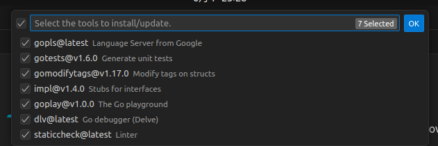
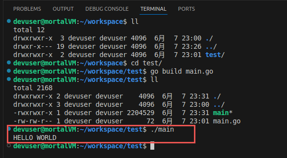

## 0. 前言
本篇内容将介绍开发环境的搭建，内容涉及：`Ubuntu22.04`、`Linux用户操作`、`Go开发`、`vscode`、`Goland`。

说明：
- 本文内容暂时不使用云服务器，使用`VMWare`+`Ubuntu22.04`，来作为开发环境。
- 内容起始点为新搭建的`Ubuntu22.04`环境，关于`VMWare`+`Ubuntu22.04`可以参考其他内容（[基于VMware虚拟机的Ubuntu22.04系统安装和配置（新手保姆级教程）](https://blog.csdn.net/qq_42417071/article/details/136327674)）。

---

## 1. Linux 用户管理

### 1.1 为什么需要用户管理？
`Linux`系统默认以`root`（超级管理员）身份运行，但直接使用root开发存在高风险​：
- 误操作可能删除系统关键文件（如`/etc`、`/usr`）；
- 恶意软件或脚本若以`root`权限运行，会直接破坏系统；
- 项目文件若由`root`创建，普通用户可能无法访问或修改（权限冲突）。
因此，​开发时应使用普通用户，仅在需要管理员权限时临时切换（通过`sudo`）。

---

### 1.2 Linux 用户管理操作

**【用户创建】**

为避免与系统默认用户混淆，在此创建一个专用的开发用户（如`devuser）`：
```bash
sudo useradd -m -s /bin/bash 用户名
# -m：自动创建用户家目录（路径：/home/用户名），存放个人文件和项目；
# -s /bin/bash：指定默认shell为bash
```
或
```bash
sudo useradd 用户名
```
区别：
- 前者：直接创建用户，无平密码设置要求。
- 后者：回车后会有交互提示，要求设置密码，以及其他信息设置操作。

**【用户密码设置】**
```bash
sudo passwd devuser  
# 按提示输入两次密码（输入时不显示）
```

**【演示】**
```bash
mortal@mortalVM:~$ sudo useradd -m -s /bin/bash devuser
[sudo] password for mortal: 

mortal@mortalVM:~$ sudo passwd devuser
New password: 
Retype new password: 
passwd: password updated successfully
```

---

### 1.3 sudo 权限授权【关键】

**作用**：让`devuser`能通过`sudo`执行管理员命令（无需切换`root`），避免直接使用`root`：
```bash
# 编辑sudoers文件（危险操作！必须用visudo避免语法错误）
sudo visudo
```
在文件末尾添加（替换`devuser`为你的用户名）：
```bash
# 允许devuser以任何用户/组身份执行所有命令（需输入密码）
devuser ALL=(ALL:ALL) ALL  
```

---

### 1.4 用户切换

```bash
# 切换到devuser（-表示加载用户环境变量）
su - devuser  
```

---

## 2. 系统准备/必要软件安装

### 2.1 安装必要软件

新安装的`Ubuntu`需要先更新系统包列表并安装基础工具：
```bash
# 更新包索引（必须）
sudo apt update && sudo apt upgrade -y

# 安装常用工具（curl用于下载、git用于代码管理、vim用于编辑、tree树形显示目录）
sudo apt install -y curl git vim tree

# 如果你不能在win与Ubuntu进行内容的复制粘贴，可以尝试以下操作
sudo apt install open-vm-tools open-vm-tools-desktop
sudo reboot  # 安装后重启
```

---

### 2.2 sudo 以管理员权限执行命令
​全称​：Super User Do（以超级用户身份执行）

**​核心作用**​：
- `Linux` 系统为了安全，默认普通用户没有修改系统关键文件、安装软件等“高风险”操作的权限（这些操作需要“超级用户”root 权限）。
- `sudo` 允许普通用户临时获取管理员权限，以执行特定命令，避免直接使用 root 用户登录（降低误操作风险）。

**​常见用法​**：
- 基本格式：`sudo [命令]`

例如：
- 安装软件：`sudo apt install nginx`（以管理员权限运行 `apt install`）
- 修改系统文件：`sudo nano /etc/hosts`（用 `nano` 编辑需要管理员权限的系统文件）
- 重启服务：`sudo systemctl restart apache2`（重启 Apache 服务）

**​注意事项**​：
- 执行 `sudo` 时，系统会提示输入当前用户的密码​（而非 `root` 密码），验证通过后才允许操作（首次使用可能需要输入）。
- 部分系统会配置 `sudoers` 文件（通过 `visudo` 命令编辑），允许特定用户无需密码执行某些命令（需谨慎配置，避免安全风险）。
> ​**不要滥用 sudo**​：随意用 `sudo` 执行未知脚本或命令可能导致系统崩溃或安全漏洞！

---

### 2.3 apt 软件包管理工具

全称​：Advanced Package Tool（高级包工具）

**​核心作用​**：
- `apt` 是 Debian 及其衍生系统（如 Ubuntu、Linux Mint）的官方软件包管理器，用于简化软件的安装、卸载、更新等操作。
- 它能自动解决软件依赖（例如安装一个程序时，自动安装它需要的其他库或工具），避免手动编译的麻烦。

**​常见子命令**​：
|子命令	|功能描述	|示例|
|:-----|:-----|:-----|
|apt update	|更新本地“软件源列表”（从软件源服务器获取最新可用软件包信息）	|sudo apt update|
|apt upgrade	|升级所有已安装的软件包到最新版本（基于 update 后的最新列表）	|sudo apt upgrade|
|apt install [包名]	|安装指定软件包（自动解决依赖）	|sudo apt install nginx|
|apt remove [包名]	|卸载指定软件包（保留配置文件）	|sudo apt remove nginx|
|apt purge [包名]	|彻底卸载软件包（同时删除配置文件）	|sudo apt purge nginx|
|apt search [关键词]	|搜索软件源中包含指定关键词的软件包	|apt search python3|
|apt show [包名]	|查看指定软件包的详细信息（版本、依赖、描述等）	|apt show nginx|

**​注意事项**​：
- **必须先 update**​：安装新软件前建议运行 `sudo apt update`，否则可能因软件源列表过时导致找不到最新版本或无法安装。
- ​**依赖自动处理**​：`apt install` 会自动安装所需依赖，无需手动操作（对比手动编译安装的繁琐）。
- ​**清理冗余包​**：长期使用后，可通过 `sudo apt autoremove` 删除不再需要的依赖包，释放磁盘空间。

---

## 3. 安装Go语言环境

> `Go`语言的安装方式将有很多，在此介绍**手动下载二进制包**​（版本可控）

### 3.1 下载Go安装包
访问[Go官方网站](https://go.dev/dl/)，选择最新的稳定版（如go1.24.0.linux-amd64.tar.gz），或直接通过命令下载（以1.24.0为例）：
```bash
# 下载Go安装包（替换为你需要的版本号）
cd /tmp
wget https://dl.google.com/go/go1.24.0.linux-amd64.tar.gz

# 可以看看你下载的包 -------------------------------------------------------------
devuser@mortalVM:/tmp$ ll
total 76644
drwxrwxrwt 20 root    root        4096  6月  7 22:15 ./
drwxr-xr-x 20 root    root        4096  6月  7 18:48 ../
-rw-rw-r--  1 devuser devuser 78382844  2月 12 01:57 go1.24.0.linux-amd64.tar.gz # 这里
...
```

**【为什么有 cd /tmp 操作？】**

在 Linux 系统中，执行 cd /tmp 后再下载文件（如 Go 安装包）是一种常见且推荐的操作，主要与 /tmp 目录的设计定位和实际操作需求有关。
> 1. /tmp 目录的作用​
> /tmp（全称 "temporary"）是 Linux 系统中全局临时目录，设计初衷是存放临时文件或短期使用的文件。它的核心特性包括：
> 
> - ​所有用户可读写​：任何用户（包括普通用户）都可以在 /tmp 下创建、修改或删除文件（无需 sudo）。
> - ​系统自动清理​：大多数 Linux 系统会定期（如重启时、每天凌晨）自动清理 /tmp 中的旧文件（通过> systemd-tmpfiles-clean 或 tmpwatch 等机制），避免冗余文件长期占用磁盘空间。
> - ​无持久化要求​：适合存放不需要长期保留的临时数据（如安装包、缓存文件等）。
> 
> ​2. 为什么下载安装包时推荐用 /tmp？​​
>
> 下载 Go 安装包（或其他软件安装包）时，使用 /tmp 主要是出于以下考虑：
> 
> （1）符合“临时文件”的定位
> 
> 安装包的作用是临时传输到本地，用于安装软件。安装完成后，安装包本身通常不再需要（除非需要重新安装或校验）。将其存放在 /tmp 符合“临时文件”的设计目标，避免占用其他目录（如用户家目录 /home 或系统目录 /usr）的空间。
> 
> （2）避免权限问题
> 
> /tmp 目录的权限通常是 drwxrwxrwt（所有用户可读写执行，且粘滞位生效），普通用户无需 sudo 即可直接在 /tmp 下创建、删除文件。如果下载到其他需要权限的目录（如 /opt 或 /usr/local），可能需要 sudo 才能写入，增加操作复杂度。
> 
> （3）方便后续操作
> 
> 下载到 /tmp 后，安装时通常需要解压或运行该文件（如 tar -xzf go1.21.0.linux-amd64.tar.gz）。由于 /tmp 是> 全局可访问的，无论当前工作目录是什么，都可以直接通过路径引用（如 /tmp/go1.21.0.linux-amd64.tar.gz），无需> 额外切换目录。
> 
> ​3. 是否必须用 /tmp？可以替换为其他目录吗？​​
> 
> ​**不是必须的**，但 /tmp 是推荐选择。如果需要调整，可根据实际需求选择其他目录，但需注意：
> 
> ​用户家目录（如 ~/Downloads）​​：适合需要长期保留安装包的场景（如后续可能需要重新安装），但需确保目录有足够空间。
> 
> ​系统软件目录（如 /opt 或 /usr/local/src）​​：适合需要长期保留安装包或系统级软件的场景，但可能需要 sudo 权限写入。

---

### 3.2 解压到系统目录
`Go`需要安装到`/usr/local`目录（官方推荐），执行解压：
```bash
sudo rm -rf /usr/local/go  # 如果之前安装过旧版本，先删除
sudo tar -C /usr/local -xzf /tmp/go1.24.0.linux-amd64.tar.gz

# 示例 ---------------------------------------------------------------
devuser@mortalVM:/tmp$ sudo tar -C /usr/local -xzf /tmp/go1.24.0.linux-amd64.tar.gz
[sudo] password for devuser: 
devuser@mortalVM:/tmp$ ll /usr/local
total 44
drwxr-xr-x 11 root root 4096  6月  7 22:19 ./
drwxr-xr-x 14 root root 4096  9月 11  2024 ../
drwxr-xr-x 10 root root 4096  2月 11 07:33 go/  # 这里
```

---

### 3.3 配置环境变量

`Go`的核心环境变量需要配置到用户或系统的`bash`配置中（这里以当前用户为例）：
```bash
# 打开bash配置文件（如果用zsh则改为~/.zshrc）
vim ~/.bashrc
```
在文件末尾添加以下内容（**根据你的实际路径调整**）：
```bash
# Go环境变量
export GOROOT=/usr/local/go       # Go安装根目录（一般不需要修改）
export GOPATH=$HOME/go            # Go工作区（存放项目和依赖）
export PATH=$GOROOT/bin:$GOPATH/bin:$PATH  # 将Go工具和项目可执行文件加入PATH

# 示例 ---------------------------------------------------------------
devuser@mortalVM:/tmp$ tail ~/.bashrc -n 5

# Go环境变量
export GOROOT=/usr/local/go       # Go安装根目录（一般不需要修改）
export GOPATH=$HOME/go            # Go工作区（存放项目和依赖）
export PATH=$GOROOT/bin:$GOPATH/bin:$PATH  # 将Go工具和项目可执行文件加入PATH
```
保存后执行以下命令使配置生效：
```bash
source ~/.bashrc  # 重启终端
```

---

### 3.4 验证安装

检查Go版本，确认安装成功：
```bash
go version
# 输出类似：go version go1.24.0 linux/amd64

# 示例 ---------------------------------------------------------------
devuser@mortalVM:/tmp$ go version
go version go1.24.0 linux/amd64
```

---

### 3.5 配置国内代理（加速依赖下载）​

国内访问Go官方仓库较慢，建议配置代理（如阿里云、七牛云）：

```bash
# 设置全局代理（推荐）
go env -w GOPROXY=https://goproxy.cn,direct
```

---

### 3.6 Go 语言启航 —— HELLO WORLD

第一步：创建一个目录，并新建一个 main.go
```bash
devuser@mortalVM:~$ mkdir -p workspace/test         # 创建目录
devuser@mortalVM:~$ vim workspace/test/main.go      # 创建文件
```
第二步：写入如下内容
```go
package main

import "fmt"

func main() {
    fmt.Println("HELLO WORLD")
}
```
第三步：编译 go run 
```bash
devuser@mortalVM:~$ go run workspace/test/main.go  # 编译
HELLO WORLD
```


---

## 4. 安装/卸载开发工具【Vs Code】

### 4.1 安装安装/卸载 VS Code

**【安装】**
```bash
# 下载 VS Code DEB 包
wget "https://code.visualstudio.com/sha/download?build=stable&os=linux-deb-x64" -O code.deb

# 安装 DEB 包
sudo dpkg -i code.deb

# 修复依赖（关键步骤）​
sudo apt --fix-broken install

# 验证安装
code # 打开 VsCdoe
# code . 在当前目录打开 Vscode
```
> VS Code 的 DEB 包默认会将 code 命令添加到 /usr/bin 目录（系统级 PATH 路径），因此无需额外配置。若因特殊原因无法启动，可手动创建软链接：
```bash
sudo ln -s /opt/vscode/code /usr/bin/code
```
> **备选下载方式**
> 1. 直接在Ubuntu商店阿下载。
> 2. 使用浏览器去官方下载。

**【卸载】**

若后续需要卸载，可通过以下命令彻底删除：
```bash
# 删除安装的 DEB 包
sudo dpkg -r code

# 清理残留文件（可选）
sudo rm -rf /opt/vscode  # VS Code 主目录
sudo rm -f /usr/bin/code  # 软链接（若有）
```

---

### 4.2 安装Go扩展

- 安装`Go`插件，打开VS Code，按`Ctrl+Shift+X`打开扩展商店，搜索Go（作者：Golang），点击安装。
<!--  -->

- 按`Ctrl+Shift+p`输入：`Go Install/Update Tools`安装tools，全选安装。


---

### 4.3 使用 VsCode 进行 Go 开发
> 此处直接使用前文写的HELLO WORLD示例，进行测试
```bash
devuser@mortalVM:~/workspace$ ll
total 12
drwxrwxr-x  3 devuser devuser 4096  6月  7 23:00 ./
drwxr-x--- 19 devuser devuser 4096  6月  7 23:26 ../
drwxrwxr-x  2 devuser devuser 4096  6月  7 23:01 test/
devuser@mortalVM:~/workspace$ cd test/
devuser@mortalVM:~/workspace/test$ go build main.go     # 构建操作
devuser@mortalVM:~/workspace/test$ ll
total 2168
drwxrwxr-x 2 devuser devuser    4096  6月  7 23:31 ./
drwxrwxr-x 3 devuser devuser    4096  6月  7 23:00 ../
-rwxrwxr-x 1 devuser devuser 2204529  6月  7 23:31 main*
-rw-rw-r-- 1 devuser devuser      72  6月  7 23:01 main.go
devuser@mortalVM:~/workspace/test$ ./main               # 执行
HELLO WORLD # 结果
devuser@mortalVM:~/workspace/test$ 
```
<!--  -->