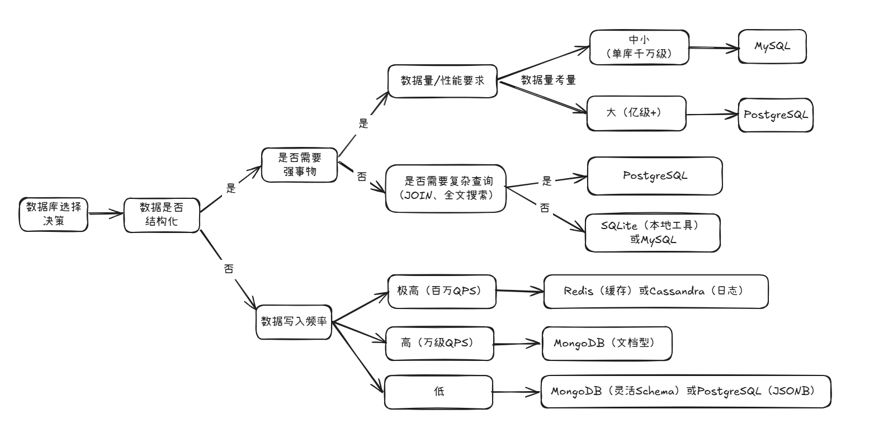

## 0. 前言
本篇内容将结合检索的资料来`介绍认识数据库`、`如何选择数据库`与`博客项目选择数据库的考量思路`。（安装方式在文末）

本文中可能存在部分专业名词，不会做过多解释，后续将分享相关文章进行讲解。

> 注：本文内容提及的选择思路仅供参考，为个人学习总结。

> [前往系列文章合集](/notes/noteroot/MiniBlog/关于项目)
---

## 1. 数据库类型与核心特点简介

数据库主要分为`关系型数据库（RDBMS）`​和`非关系型数据库（NoSQL）`​两大类，各自适用不同场景：

### 1.1 关系型数据库（RDBMS）​

**【特点】**

- 数据以`表格（Table）形式存储`，**结构固定**（行、列、字段类型）。
- 支持`SQL`语言（标准查询语句），**事务性强**（`ACID`特性：`原子性`、`一致性`、`隔离性`、`持久性`）。
- 适合需要`强数据一致性`、复杂查询的场景（比如：用户系统、订单管理）。

**【代表数据库】**

- `MySQL`​：最流行的开源关系型数据库，轻量、易用、生态成熟（与`PHP`、`Java`等主流语言深度绑定）。
- `PostgreSQL`​：功能更强大的“全能型”数据库，支持`JSON`、`地理信息`、`自定义类型`等扩展，适合复杂业务。
- `SQLite`​：嵌入式数据库（无需服务端），文件级存储，适合小型应用或本地测试（如工具类CLI程序）。

> `Go`适配性​：`Go`标准库`database/sql`原生支持`SQL`接口，配合驱动（如`go-sql-driver/mysql`）可轻松操作关系型数据库。
---

### 1.2 非关系型数据库（NoSQL）

**【特点】**
- 数据结构灵活（键值、文档、列族、图等），无需预定义`Schema`。
- 读写性能高（尤其是内存型数据库），适合**高并发**、海量数据场景。
- 事务支持较弱（部分数据库支持分布式事务），适合对一致性要求不高的场景（如缓存、日志存储）。

**【代表数据库】**
- `Redis`​：**内存键值数据库**，支持持久化，读写速度极快（`QPS可达10万+`），适合缓存、会话存储、计数器；
- `​MongoDB`​：**文档型数据库**（存储`BSON格`式，类似`JSON`），适合半结构化数据（如用户行为日志、内容管理系统）；
- `​Cassandra`​：**列族数据库**，高扩展性，适合海量数据写入（如物联网传感器数据）。

> `Go`适配性​：`Go`对`NoSQL`的支持依赖第三方驱动（如`go-redis/redis`操作`Redis`，`mongo-go-driver`操作`MongoDB`），社区生态完善。
---

## 2. Go 语言开发场景下的选择

> 由于本人当前所从事的是`Go`语言进行后端开发，因此，此处先从`Go`开发场景来考虑。后文会介绍一般的选择思路。
>
> 注：具体结合项目类型与数据选择，这里从开发`MiniBlog项目`来进行选择。

根据`Go`开发的常见需求（`Web后端`、`API服务`、`工具类应用`），项目开发选择排序（按优先级排序）：

1. **首选：`MySQL`（或`MariaDB`）​**

**【选择原因】**
- **生态成熟**​：全球使用最广的关系型数据库，与`Go`的`database/sql`接口深度兼容，驱动（如`go-sql-driver/mysql`）稳定。
- 学习成本低​：SQL语法通用，新手易上手，适合快速实现CRUD（增删改查）功能。
- 轻量高效​：安装包小（~50MB），配置简单，适合个人项目或小型服务。
- 社区支持强​：遇到问题容易找到解决方案（比如：`各种AI`、`Stack Overflow`、`官方文档`）。

> **【使用场景】**：用户系统、订单管理、博客平台等需要强数据一致性的业务。

2. **次选：`PostgreSQL`**

**【选择原因】**
- ​功能更全面​：支持JSONB（高性能JSON存储）、GIS（地理信息）、全文搜索等高级特性，适合需要复杂查询的场景。
- ​扩展性强​：支持自定义函数、存储过程，可替代部分NoSQL的功能（如`MongoDB`的文档存储）。
- ​事务更严格​：对`ACID`的支持比`MySQL`更彻底（如可重复读隔离级别下无幻读问题）。

> **【使用场景】**：需要复杂查询（如多表JOIN、地理信息筛选）、或未来可能扩展的中大型项目。

3. **缓存/高性能场景：`Redis`**

**【选择原因】**
- 速度极快​：数据存储在内存中，读写延迟仅微秒级，**适合作为缓存层减少数据库压力**。
- ​功能丰富​：支持字符串、哈希、列表、集合等数据结构，支持发布订阅、过期策略。
- `​Go`集成友好​：官方推荐驱动`go-redis/redis`功能完善，支持连接池、管道等优化。

**【使用场景】**
- 缓存高频访问的数据（如用户信息、商品详情）。
- 会话存储（替代`Cookie`，跨设备同步）。
- 计数器（如点赞数、访问量）。

---

4. **文档型需求：`MongoDB`**
**【选择原因】**
- 灵活`Schema`​：无需预定义字段，适合半结构化数据（如用户行为日志、内容管理系统）；
- ​读写性能高​：支持索引优化，适合海量数据写入（如IoT设备上报数据）；
- `​Go`驱动成熟​：官方驱动`mongo-go-driver`支持`CRUD`、聚合查询等操作。

> **【使用场景】**：内容管理（如博客文章、评论）、日志存储、需要快速迭代的敏捷项目（避免频繁修改表结构）。

---

> 在使用`Go`开发`MiniBlog`中将选择`MySQL`和`Redis`。

---

## 3. 数据库选择的关键考量维度

选择数据库时需要考虑如下6个关键问题：

|**维度**|**问题描述**|**大厂使用案例**|
|:----|:----|:----|
|**1.数据模型**|数据：结构化（固定表结构）OR 非结构化（如：JSON、日志）|Mysql（结构化）-> GitHub用户表；MongoDB（非结构化）-> Netflix剧集元数据|
|**2.事物需求**|是否需要**强一致性**（如：转账）三是否需要`ACID特性`？|PostgreSQL（强ACID）→ Apple App Store支付系统；Redis（弱事务）→ 微博点赞计数|
|**3.性能需求**|**读写频率多高？单表数据量多大？是否需要低延时（如：毫秒级响应）？**|Redis（百万QPS）→ Twitter实时消息缓存；Cassandra（亿级写入）→ IoT设备数据存储|
|**4.拓展性**|数据量是否爆炸式增长？是否需要水平拓展（分库分表）？|Cassandra（线性扩展）→ 亚马逊商品评论；MySQL（垂直扩展为主）→ 中小型电商订单|
|**5.生态与工具链**| **团队是否熟悉该数据库？** 是否有成熟的ORM/工具支持（如Go的driver）？|MySQL（生态成熟）→ 几乎所有Go项目；PostgreSQL（JSONB支持）→ 内容管理系统|
|**6.成本**|硬件/云服务成本？维护复杂度（如主从复制、备份）？|SQLite（零成本）→ 本地工具；Redis（内存成本）→ 高频缓存场景|

---

## 4. 分场景详解：如何根据需求匹配数据库？​

### 场景1：结构化数据 + 强事务（如用户系统、订单管理）​

**【典型特征】**
- 数据以表格形式存储（用户ID、姓名、订单余额）。
- 需要保证事物的`ACID特性`（如：**“下单 -> 扣库存 -> 支付”**，必须原子性）。
- 数据量中等（**单库单表千万级以内**），无需复杂扩张。

**【推荐数据库】**：`MySQL` / `MariaDB`

**【选择依据】**
- **数据模型匹配**​：`MySQL`是典型的关系型数据库，支持标准`SQL`，完美适配结构化数据。
- **事务支持**​：`MySQL` `InnoDB`引擎支持`ACID`，GitHub（2023年数据）的`MySQL`集群处理了每天数十亿次事务（如用户关注、Issue提交）。
- **​生态成熟**​：如`Go`开发，`Go`的`database/sql`+`go-sql-driver/mysql`驱动稳定，配合`ORM`（如`GORM`）可快速实现`CRUD`。
- **成本可控**​：单实例硬件成本约500元/月（4核8G），适合中小型项目。

**【大厂案例】**（`网络数据`）
- **GitHub**：早期用`MySQL`存储用户、仓库、Issue等核心数据，通过分库分表支撑亿级用户。
- **腾讯**：微信支付系统使用`MySQL`集群，通过主从复制+读写分离保证高可用。

---

### 场景2：复杂查询 + 半结构化数据（如内容管理、日志分析）​

**【典型特征】**
- 数据结构不固定（如文章可能带标签、评论、多媒体链接）。
- 需要复杂查询（如多表JOIN、全文搜索、地理信息筛选）。
- 数据量较大（单表亿级），需要扩展性。

**【推荐数据库】**：`PostgreSQL`

**【选择依据】**
- **​数据模型灵活**​：支持`JSONB`（高性能`JSON`存储）、数组、范围类型，可替代部分`NoSQL`场景。
- **查询能力强**​：支持CTE（公共表表达式）、窗口函数、全文搜索（tsvector），`Netflix`用`PostgreSQL`分析用户观看行为（如“连续观看3集以上的用户”）。
- **扩展性优秀**​：支持自定义函数（`PL/pgSQL`）、分区表（解决亿级数据查询慢问题）。
- **事务可靠​**​：`ACID`支持比`MySQL`更严格（如可重复读隔离级别无幻读）。

**【大厂案例】**（`网络数据`）
- **Apple**：`App Store`的评论系统使用`PostgreSQL`，通过`JSONB`存储动态评论内容（如图片、链接）。
- **Spotify**：用户歌单元数据存储在`PostgreSQL`，支持快速查询“某歌手的热门歌单”。
---

### 场景3：高性能缓存/会话存储（如高频数据读取、会话共享）​

**【典型特征】**
- 数据读写频率极高（QPS需达10万+）。
- 数据生命周期短（如缓存过期自动删除）。
- 需要低延迟（响应时间<1ms）。

**【推荐数据库】**：`Redis`

**【选择依据】**
- **​性能极致**​：内存存储+单线程模型（避免锁竞争），官方测试`QPS`可达10万+（读）/8万+（写）。
- **​数据结构丰富​**：支持字符串、哈希（如用户信息）、列表（如消息队列）、集合（如去重标签）。
- **​持久化可选**​：`RDB`（快照）+`AOF`（日志）保证数据不丢失（适合会话存储）。
> **`​Go`开发中集成友好**​：`go-redis/redis`驱动支持连接池、管道（Pipeline），减少网络开销。

**【大厂案例】**（`网络数据`）
- **Twitter**：用`Redis`缓存用户时间线（每条推文被百万次读取），降低`MySQL`压力。
- **微博**：用户登录态（`Session`）存储在`Redis`，支持全国多机房快速同步。

---

### 场景4：海量数据写入 + 高扩展性（如IoT传感器、日志收集）​

**【典型特征】**
- 据量极大（单表日均写入亿级）。
- 写入频率高（每秒数千条），但查询简单（如按时间范围查询）。
- 需要水平扩展（增加节点即可提升容量）。

**【推荐数据库】**：`Cassandra` / `ScyllaDB`

**【选择依据】**
- **线性扩展**​：`Cassandra`通过分布式架构，添加节点可线性提升读写能力（亚马逊用其存储商品评论，支撑亿级日活）。
- ​**高写入性能​**：采用`LSM`树（`Log-Structured Merge-Tree`）存储引擎，写入先存内存再刷盘，适合IoT设备高频上报数据。
- ​**无单点故障**​：数据多副本存储（默认3副本），单节点宕机不影响服务。

**【大厂案例】**（`网络数据`）
- 亚马逊：商品评论系统使用`Cassandra`，日均处理数亿条用户评论。
- 特斯拉：车辆传感器数据（如车速、电池状态）存储在`ScyllaDB`（`Cassandra`分支），支持实时分析。

---

### 场景5：文档型数据 + 快速迭代（如博客、CMS系统）​

**【典型特征】**
- 数据以文档形式存储（如`JSON格`式的博客文章，包含标题、作者、标签）。
- 需要灵活`Schema`（新增字段无需修改表结构）。
- 开发周期短（需快速上线，避免频繁`DDL`操作）。

**【推荐数据库】**：`MongoDB`

**【选择依据】**
- **`Schema`灵活**​：无需预定义字段，新增字段自动生效（适合博客文章的动态标签）。
- **开发效率高**​：支持`JSON`查询语法，`Go`的`mongo-go-driver`可直接操作`BSON`（二进制`JSON`）。
- **索引优化​**：支持复合索引、文本索引（如按文章标题搜索），满足大部分查询需求。

**【大厂案例】**（`网络数据`）
- **Netflix**：用`MongoDB`存储剧集元数据（如导演、演员、简介），支持快速迭代的内容管理后台。
- **腾讯文档**：早期用`MongoDB`存储文档内容（如文字、表格），通过分片（`Sharding`）支持海量文档存储。

---

## 5. 决策流程图（附具体判断步骤）​




【示例应用】​：
假设你要做一个“在线博客系统”：

- **数据结构**：文章（标题、作者、内容、标签）→ 结构化；
- **事务需求**：无强事务（发文章无需扣库存）→ 弱事务；
- **性能要求**：日均10万次阅读（读多写少）→ 读性能要求中等；
- **扩展性**：初期数据量小（10万篇文章）→ 无需水平扩展；
- **结论**：选`MySQL`（或`PostgreSQL`，若未来需要全文搜索）。

---

## 6. 总结：选择的核心原则

1. **匹配数据模型**​：结构化数据优先关系型（`MySQL`/`PostgreSQL`），非结构化选文档型（`MongoDB`）或键值型（`Redis`）；
2. **​事务优先级**​：强事务（如支付）选`PostgreSQL`/`MySQL InnoDB`，弱事务（如缓存）选`Redis`；
3. **​性能与扩展性**​：高频读写选`Redis`/`Cassandra`，海量写入选`Cassandra`，快速迭代选`MongoDB`；
4. **生态与成本**​：优先选团队熟悉的（如`Go`开发者更熟悉`MySQL`），云服务可选托管版（如`AWS RDS for MySQL`）降低维护成本。

---

## 7. MySQL和Redis安装

### 7.1 安装MySQL
```bash
# 更新包列表
sudo apt update

# 安装MySQL服务端和客户端
sudo apt install -y mysql-server mysql-client

# 启动并设置开机自启
sudo systemctl start mysql
sudo systemctl enable mysql

# 验证安装（登录MySQL）
sudo mysql -u root -p  # 输入安装时设置的root密码（首次安装无密码，直接回车）
```
> 注意​：MySQL 8.0+默认启用强密码策略，首次登录可能需要修改root密码（按提示操作）。

---

### 7.2 安装Redis
```bash
# 添加Redis仓库（可选，获取最新稳定版）
sudo add-apt-repository -y ppa:redislabs/redis
sudo apt update

# 安装Redis服务端（自动包含客户端工具）
sudo apt install -y redis-server

# 输出版本号即成功（如 Redis server v=7.4.1）
redis-cli --version  

# 演示：start ----------------------------------------------------------------------------------
mortal@vm:/tmp$ redis-cli --version
redis-cli 7.4.1 # 版本号
# 演示：end ----------------------------------------------------------------------------------

# 启动并设置开机自启
sudo systemctl start redis-server
sudo systemctl enable redis-server

# 验证安装（连接Redis）
redis-cli ping  # 输出PONG表示成功
```

---