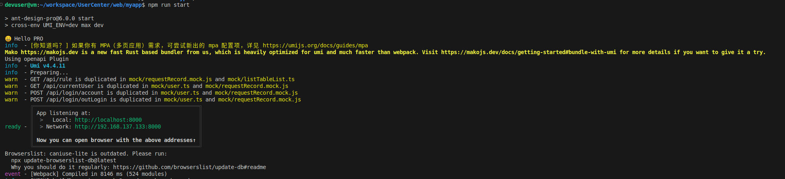
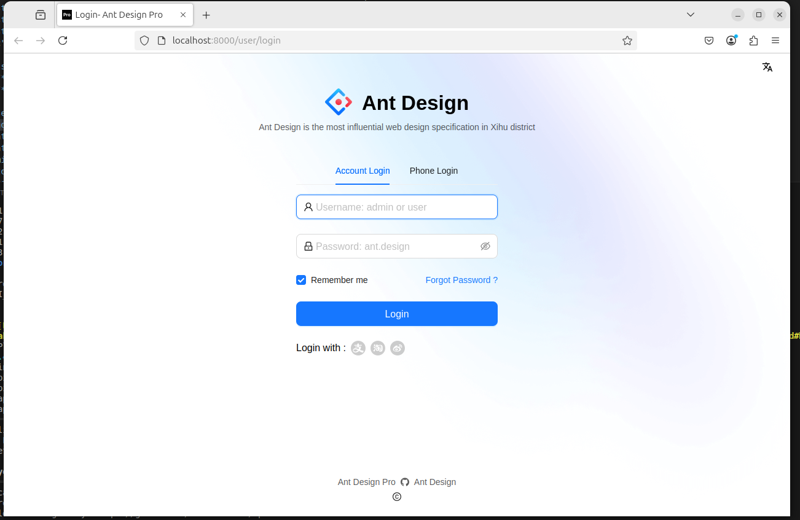
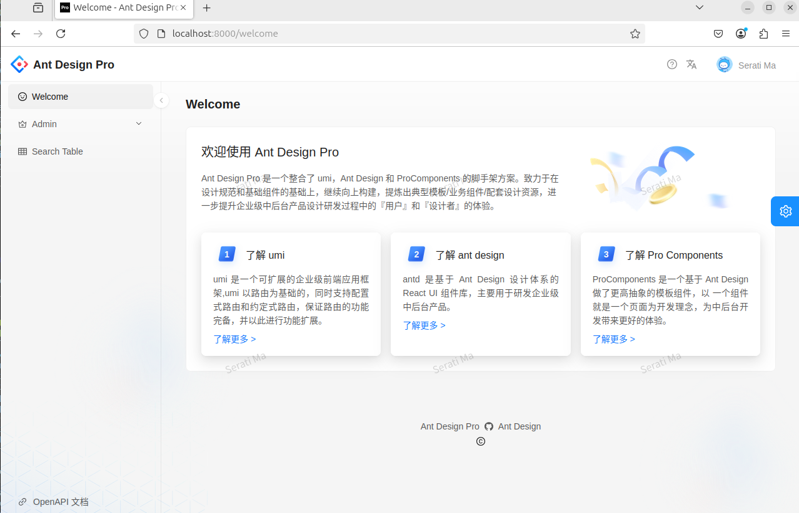

## 前言

本文中使用的前端脚手架是：Ant Design Pro

作为后端开发者，我们的核心需求是「快速让前端页面跑起来」——不需要复杂的前端工程化知识，不需要从头搭建环境，重点是复用现成工具，把精力放在「数据展示」和「业务对接」上。

本文用最短路径，教你用Ant Design Pro（以下简称「Pro」）从0到1搭一个可视化页面，并解释每一步的目标、操作、原因​（后端视角）。

> [官网地址](https://pro.ant.design/zh-CN/)

---

## 1. 目标明确：我们要做什么？​

最终目标是：用Pro生成一个包含「数据看板」的基础中后台页面，页面能展示后端API返回的数据（如用户管理系统的用户数据表格），并支持基础交互（如筛选、跳转）。

**【为什么选Pro？​】**

- 开箱即用：内置React环境、路由、状态管理（Umi框架），无需手动配置Webpack/Vite。
- 模板丰富：直接提供仪表盘、列表页等中后台常用页面模板，改数据就能用。
- 适配后端：支持快速对接现有API（通过mock或代理），减少前后端联调成本。


---

## 2. 环境准备（目标：让Pro能跑起来）​

> 环境背景：本文基于 ​Ubuntu 24.04​ 系统，后端开发者对Linux环境更熟悉，Windows/macOS用户可参考调整命令。

**操作步骤**

- 安装：`Nodejs`、`npm`

```bash
# 步骤1：更新包索引（可选，但推荐）
sudo apt update

# 步骤2：安装Node.js（v18+）和npm（随Node.js自动安装）
sudo apt install -y nodejs npm
```

- 安装验证

> 安装完成后，通过以下命令确认版本（Node.js≥14，npm≥6即可）：

```bash
npm -v   # 输出类似9.2.0（版本号≥6即可）
nodejs -v   # 输出类似v18.19.1（版本号≥14即可）
```

---


## 3. 初始化项目（目标：生成基础框架）​

**操作步骤**

> Pro官方推荐通过 pro create 命令快速创建项目（本质是基于Umi的脚手架封装）。

```bash
# 步骤1：全局安装Pro CLI（首次使用需要）
sudo npm i -g @ant-design/pro-cli

# 步骤2：创建项目（交互式选择模板）
pro create myapp
```
**关键选择**

执行 pro create myapp 后，终端会提示选择模板类型。​建议选「simple」​​（精简版）：
- 不需要完整的企业级功能（如多租户、复杂权限）；
- 减少冗余代码，更快跑通基础流程。

---

## 4. 启动项目（目标：验证环境是否正常）​

> 执行完创建命令后，会生成一个名为 myapp 的项目文件夹。通过以下命令查看目录结构：

**操作步骤**

- 生成项目目录
```bash
# 进入目录
cd myapp

ls   # 输出应包含config、src、public、package.json等核心文件
config  jest.config.ts  jsconfig.json  mock  node_modules  package.json  package-lock.json  pnpm-lock.yaml  public  README.md  src  tests  tsconfig.json  types
```

- 安装依赖并启动
> 实际就是找到package.json，去下载dependencies列表里的内容。
```bash
# 步骤1：安装项目依赖（首次需要）
npm install   # 等待下载完成（约1-2分钟，视网络速度）

# 步骤2：启动本地开发服务
npm run start
```


---

## 5. 成果预览
> 登陆界面



> 主页样式

