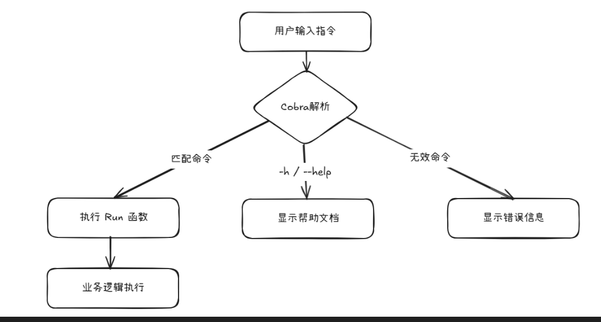

---


> 我的随笔录：[Satori2Core 随笔录 —— 更新计划 / 笔录目录](https://satori2core.github.io/notes/noteroot/about/%E5%85%B3%E4%BA%8E%E6%9B%B4%E6%96%B0%E8%AE%A1%E5%88%92.html)

---


## Cobra 简单认识与使用

### 1. Cobra 是什么？

`Cobra` 是一个用于构建 **命令行应用（CLI）** 的 `Go` 语言库。它提供了创建命令、子命令、参数解析、帮助文档生成等能力，帮助开发者快速开发专业级的命令行工具。

---

### 2. 有什么用？能解决什么问题？

- **问题**​：开发 `CLI` 工具时需要处理复杂的参数解析（如 `-v/--verbose`）、多级命令（如 `git commit -m "msg"`）、自动生成帮助文档等。
- **解决方案**​：`Cobra` 封装了这些重复工作，让开发者专注于核心业务逻辑。
- **核心能力​**：
    - 创建嵌套命令（命令+子命令）
    - 自动生成帮助文档（`--help`）
    - 支持短/长参数（`-v/--verbose`）
    - 支持参数验证和默认值

---

### 3. 什么场景下会用到？​

假设要开发以下工具：
- 一个类似 `git` 的版本控制工具：`myGit commit -m "message"`
- 本地开发工具：`dev build --debug`
- 服务器管理工具：`server start --port=8080`（此处指定端口号）
> 在依托于代码管理平台存储代码时，项目中可能需要一个配置文件，我们可能更多的会提供一个项目配置文件模板，而不是本地开发中实际包含开发环境信息的配置文件。此时，可以借助`Cobra`在程序启动的时候指定配置文件，来实现服务的正常启动。

---

## Cobra 使用的基本认识

### 1. 简单代码与使用示例

> Go 代码示例
```go
package main

import (
	"fmt"

	"github.com/spf13/cobra"
)

func main() {
	var rootCmd = &cobra.Command{
		Use:   "simple",
		Short: "一个简单的例子",
		Long:  "这个例子演示了根命令的执行",
		// 设置根命令的Run函数
		Run: func(cmd *cobra.Command, args []string) {
			fmt.Println("你好，这是根命令在执行！")
		},
	}

	rootCmd.Execute()
}
```

> 操作演示效果

```bash
# 示例：开始 -----------------------------------------------------------------------------
➜  file-tool git:(learn/cobra) ✗ go build -o simple   # 编译成可执行程序
➜  file-tool git:(learn/cobra) ✗ ./simple             # 直接执行
你好，这是根命令在执行！
➜  file-tool git:(learn/cobra) ✗ 
➜  file-tool git:(learn/cobra) ✗ ./simple --help      # 带 --help 参数执行 => 帮助文档
这个例子演示了根命令的执行

Usage:
  simple [flags]

Flags:
  -h, --help   help for simple
➜  file-tool git:(learn/cobra) ✗ 
# 示例：结束 -----------------------------------------------------------------------------
```

---

### 2. Cobra 命令基本认识

在 `Cobra` 中，一个命令（Command）由以下几个重要部分组成：

- **​Use**: 命令的调用名称。比如在根命令中，我们通常用可执行文件的名字，如 `simple`。在子命令中，比如`create`，那么调用就是`simple create`。
- **Short**: 命令的简短描述，通常在帮助文档的列表中出现。
- **Long**: 命令的详细描述，当用户查看具体命令的帮助（如`simple create --help`）时会显示。
- ​**Run**: 当命令被执行时调用的函数。这个函数就是命令要执行的业务逻辑。

另外，还可以给命令添加参数（Flags）。参数分为两种：
- 持久参数（Persistent Flags）​​：可以作用于该命令及其所有子命令。
- 本地参数（Local Flags）​​：仅作用于当前命令。

---

### 3. 示例代码与Cobra命令认识的解读

```go
func main() {
    // 创建根命令（顶级命令）
	var rootCmd = &cobra.Command{
        // 指定命令名称
        Use:   "simple",
        // 命令的简短描述
		Short: "一个简单的例子",
        // 命令的详细描述（使用 -h/-help后输出的提示）
		Long:  "这个例子演示了根命令的执行",
		// 当命令被执行时调用的方法（此处即使用simple指令会调用执行这个方法）
		Run: func(cmd *cobra.Command, args []string) {
			fmt.Println("你好，这是根命令在执行！")
		},
	}

	rootCmd.Execute()
}
```

---

#### 根命令（顶级命令）也是默认命令
> 在执行CLI程序时，若不指定调用的命令，就是执行根命令。
- 即，如果把如上程序编译成名为 `test` 的可执行文件，直接 `./test`或`./test simple`效果是一样的。

```bash
# 示例：开始 -----------------------------------------------------------------------------
➜  file-tool git:(learn/cobra) ✗ go build -o test
➜  file-tool git:(learn/cobra) ✗ ll
总计 3.3M
-rw-rw-r-- 1 devuser devuser  377  6月 22 17:31 main.go
-rwxrwxr-x 1 devuser devuser 3.3M  6月 22 18:15 test
➜  file-tool git:(learn/cobra) ✗ ./test 
你好，这是根命令在执行！
➜  file-tool git:(learn/cobra) ✗ ./test simple
你好，这是根命令在执行！
➜  file-tool git:(learn/cobra) ✗ 
# 示例：结束 -----------------------------------------------------------------------------
```

**注意**：
根命令的 `Use` 值建议与可执行文件名一致，但不是强制性的
当调用方式与 `Use` 值不匹配时：
```bash
# 当 Use 为 "simple" 时：
./test simple   # 正常执行根命令
./test demo     # 会显示错误：unknown command "demo"
```

---

#### Run 参数是必须的吗？

**答案**：Run字段不是必须的，如果不设置，执行命令时`Cobra`会显示帮助信息（即`Long`或`Short`的内容）。
> 注释掉 `Run` 部分代码
```bash
# 示例：开始 -----------------------------------------------------------------------------
➜  file-tool git:(learn/cobra) ✗ go build -o test
➜  file-tool git:(learn/cobra) ✗ ./test          
这个例子演示了根命令的执行

➜  file-tool git:(learn/cobra) ✗ ./test simple   
这个例子演示了根命令的执行

➜  file-tool git:(learn/cobra) ✗ 
# 示例：结束 -----------------------------------------------------------------------------
```

---

#### 哪些参数是必须的？

**答案**：没有。
> 只保留 `Run` 部分代码
```bash
# 示例：开始 -----------------------------------------------------------------------------
➜  file-tool git:(learn/cobra) ✗ go build -o test
➜  file-tool git:(learn/cobra) ✗ ./test       # 直接执行
你好，这是根命令在执行！                          # 调用 Run 对应的方法输出内容
➜  file-tool git:(learn/cobra) ✗ ./test -h    # 查看命令详情
Usage:
   [flags]

Flags:
  -h, --help   help for this command
➜  file-tool git:(learn/cobra) ✗ 
# 示例：结束 -----------------------------------------------------------------------------
```

---

### 4. 必看小结

#### 4.1 根命令 Use 字段的隐含逻辑

根命令的 Use 值建议与可执行文件名一致，但不是强制性的

当调用方式与 Use 值不匹配时：

```bash
# 当 Use 为 "simple" 时：
./test simple   # 正常执行根命令
./test demo     # 会显示错误：unknown command "demo"
```

---

#### 4.2 Run 函数支持参数解析

当存在位置参数时：

```go
Run: func(cmd *cobra.Command, args []string) {
    fmt.Println("位置参数:", args)
}
```

使用：

```bash
./simple file1.txt file2.jpg
# 输出: 位置参数: [file1.txt file2.jpg]
```

---

#### 4.3 -h/--help 帮助系统的智能行为

当使用 `-h/--help` 时，即表示要输出命令帮助信息。
- `-h/--help`：是Cobra内置提供的。

**工作原理**​：当系统检测到 --help 时，Cobra 会：
- 收集命令的 Short/Long/Example
- 列出所有可用子命令
- 显示参数说明
- **​跳过 Run 函数执行**

> - 当用户输入 --help 时，Cobra 会阻止执行 Run 函数
> - 帮助系统完全独立于业务逻辑

```go
var rootCmd = &cobra.Command{
    // 省略Short/Long...
    Run: func(cmd *cobra.Command, args []string) {
        // 这里不会执行
    },
}
```

---

#### 4.4 核心字段作用总结表

|字段	|必要性	|显示位置	|作用说明|
|:------|:------|:------|:------|
|Use	|推荐	|帮助文档/错误提示	|定义命令调用方式|
|Short	|推荐	|命令列表(help主界面)	|简洁描述命令功能|
|Long	|可选	|命令详细帮助(子命令帮助)	|提供详细使用说明|
|Run	|可选	|-	|命令的核心业务逻辑|

---

#### 4.5 典型工作流程图示



---

#### 4.6 最小推荐配置

至少携带：`Use`、`Short`、`Run`

```go
// 最小推荐配置
&cobra.Command{
    Use:   "有意义的名称",
    Short: "简洁描述(20字内)",
    Run:   yourLogic, // 实际业务逻辑
}
```

---