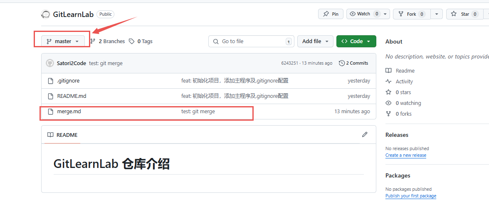
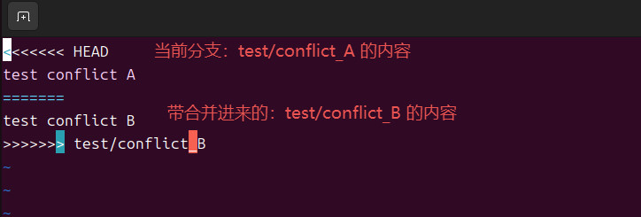
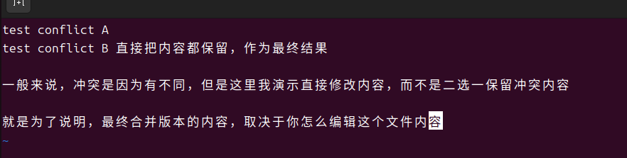
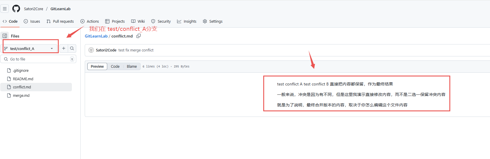

> 我的随笔录：[Satori2Core 随笔录 —— 更新计划 / 笔录目录](https://satori2core.github.io/notes/noteroot/about/%E5%85%B3%E4%BA%8E%E6%9B%B4%E6%96%B0%E8%AE%A1%E5%88%92.html)


---

## 0. 前言

前面的文章简单介绍了`Git`本地环境配置和`Git`第一次提交的基本操作，本文将以分享关于`Git`分支管理内容。

分支（Branch）是 Git 最核心的功能之一，它允许开发者在独立的“时间线”上开发新功能、修复 bug 或实验新想法，而不会影响主分支（如 main）的稳定性。

论是个人项目还是团队协作，合理的分支管理都能大幅提升代码质量和开发效率。

本文将以 ​​“GitLearnLab” 项目​ 为例，结合实际开发场景（如新增功能、修复紧急 bug），详细讲解分支的创建、切换、合并、挑合（Cherry-pick）​​ 等核心操作，并总结最佳实践。

---

## 1. 为什么需要分支？

想象一个场景：你正在开发一个新功能（如“用户登录”），但主分支（main）需要保持稳定（可能明天就要发布版本）。

如果直接在 main 分支写代码：

- 一旦新功能未完成，main 分支会被“污染”（包含未完成功能的代码）
- 若此时需要紧急修复线上 bug，无法直接在 main 分支提交（会打断新功能开发）

​**分支的价值​**：

- **隔离开发**：新功能、bug 修复、实验性代码互不干扰
- **保护主分支**：主分支始终是“可发布状态”（仅包含经过测试的稳定代码）
- **灵活协作**：团队成员可在各自分支开发，完成后合并到主分支

---

## 2. 分支的基础操作 —— 创建与切换

### 2.1 查看当前分支

在 Git 中，每个仓库默认有一个 main（或 master，取决于初始化配置）分支。执行以下命令查看当前所在分支：

```bash
# 末尾带 * 号的是当前分支
git branch  

# 示例：start -----------------------------------------------------------------
➜  GitLearnLab git:(master) git branch  
* master    # 本地只有一个分支，当前在master分支
➜  GitLearnLab git:(master) 

# 示例：end -------------------------------------------------------------------
```

---

### 2.2 创建新分支

开发新功能或修复 bug 时，需要从当前分支（如 master）创建一个新分支。例如，我们要开发“用户登录”功能，创建 feature/login 分支：

> 注： 基于 X 分支，新建 Y 分支，年则 Y 的内容和 X 完全相同（包含历史提交记录）。

```bash
# -b 表示“创建并切换”到新分支
git checkout -b feature/login  

# 如上命令等价于两条命令
git branch feature/login   # 先创建分支
git checkout feature/login # 再切换到该分支

# 示例：start -----------------------------------------------------------------
➜  GitLearnLab git:(master) git branch feature/login
➜  GitLearnLab git:(master) git checkout feature/login 
切换到分支 'feature/login'
➜  GitLearnLab git:(feature/login) git branch
* feature/login     # 当前处于新建的分支
  master
➜  GitLearnLab git:(feature/login) 
# 示例：end -------------------------------------------------------------------
```

---

### 2.3 切换分支

从当前分支切换到其他分支（如从 feature/login 切回 master）：

```bash
# 切换到 master 分支
git checkout master  

# 示例：start -----------------------------------------------------------------
➜  GitLearnLab git:(feature/login) git checkout master
切换到分支 'master'
您的分支与上游分支 'origin/master' 一致。
➜  GitLearnLab git:(master) 
# 示例：end -------------------------------------------------------------------
```

---

### 2.4 查看所有分支

查看本地所有分支（包括已删除但未清理的）：

```bash
# -a 表示“all”，显示本地和远程分支
git branch -a  

# 示例：start -----------------------------------------------------------------
➜  GitLearnLab git:(master) git branch -a
  feature/login
* master
  remotes/origin/master
➜  GitLearnLab git:(master) 
# 示例：end -------------------------------------------------------------------
```

---

### 2.5 删除分支

当分支开发完成（如新功能已合并到主分支），可删除本地分支：

**注**：
- -d 表示“安全删除”（分支已合并时才允许删除）
- -D 表示“强制删除”（分支没有合并也删除）

```bash
# -d 表示“安全删除”（分支已合并时才允许删除）
git branch -d feature/login  

# 示例：start -----------------------------------------------------------------
➜  GitLearnLab git:(master) git branch -d feature/login 
已删除分支 feature/login（曾为 09a29dc）。
➜  GitLearnLab git:(master) git branch -a
* master
  remotes/origin/master
  # 前文创建的 feature/login 分支已删除
➜  GitLearnLab git:(master) 
# 示例：end -------------------------------------------------------------------
```

---

## 3. 分支合并：将分支代码整合到主分支

开发完“用户登录”功能后，需要将 feature/login 分支的代码合并到 main 分支，让主分支包含新功能。

### 3.1 合并前的准备（重要！！！）

- **确保主分支（master）是最新的**（可能他人已推送新代码）。【使用 git pull命令】
- 合并操作是在被合并目标分支上，将其他名分支合并到所在分支。


```bash
git checkout master          # 切换到 master 分支
git pull origin master       # 拉取远程 master 分支的最新代码（若关联了远程）

# 示例：start -----------------------------------------------------------------
➜  GitLearnLab git:(master) git checkout -b feature/login
切换到一个新分支 'feature/login'
➜  GitLearnLab git:(feature/login) git branch -a
* feature/login
  master
  remotes/origin/master
➜  GitLearnLab git:(feature/login) git checkout master
切换到分支 'master'
您的分支与上游分支 'origin/master' 一致。
➜  GitLearnLab git:(master) git pull origin master
来自 github.com:Satori2Core/GitLearnLab
 * branch            master     -> FETCH_HEAD
已经是最新的。  # 此处由于远端主分支没有任何操作，所以这里没有拉取内容的信息。
➜  GitLearnLab git:(master)   
# 示例：end -------------------------------------------------------------------
```

---

### 3.2 执行合并

切换到目标分支（master），并合并源分支（feature/login）：

```bash
# 将 feature/login 合并到当前分支（master）
git merge feature/login  

# 示例：start -----------------------------------------------------------------
➜  GitLearnLab git:(feature/login) git branch -a
* feature/login     # 工作分支
  master
  remotes/origin/master
➜  GitLearnLab git:(feature/login) git status  # 看看工作区状态
位于分支 feature/login
无文件要提交，干净的工作区
➜  GitLearnLab git:(feature/login) echo "# test merge branch" > merge.md   # 模拟开发修改
➜  GitLearnLab git:(feature/login) ✗ git status # 看到有修改
位于分支 feature/login
未跟踪的文件:
  （使用 "git add <文件>..." 以包含要提交的内容）
	merge.md

提交为空，但是存在尚未跟踪的文件（使用 "git add" 建立跟踪）
➜  GitLearnLab git:(feature/login) ✗ git add .    
➜  GitLearnLab git:(feature/login) ✗ git commit -m "test: git merge" 
[feature/login 6243251] test: git merge
 1 file changed, 1 insertion(+)
 create mode 100644 merge.md
➜  GitLearnLab git:(feature/login) git push --set-upstream origin feature/login    # 远程没有，第一次推送的指令（后续使用 git push 即可）
# 省略输出的提示内容...

➜  GitLearnLab git:(feature/login) git checkout master # 切换到主分支
切换到分支 'master'
您的分支与上游分支 'origin/master' 一致。
➜  GitLearnLab git:(master) ll       # 这里可以看见没有前面在 feature/login 分支新建的文档 merge.md 
总计 4.0K
-rw-rw-r-- 1 devuser devuser 27  6月 10 22:03 README.md
➜  GitLearnLab git:(master) git merge feature/login    # 执行合并
更新 09a29dc..6243251
Fast-forward
 merge.md | 1 +
 1 file changed, 1 insertion(+)
 create mode 100644 merge.md
➜  GitLearnLab git:(master) ll     
总计 8.0K
-rw-r--r-- 1 devuser devuser 20  6月 16 22:27 merge.md  # 这里出现了 merge.md，即合并完成 
-rw-rw-r-- 1 devuser devuser 27  6月 10 22:03 README.md
➜  GitLearnLab git:(master) 
# 示例：end -------------------------------------------------------------------
```
> 看看效果？



---

### 3.3 合并冲突（Merge Conflict）​

刚刚的操作是最理想的情形，我们没有出现**合并冲突**。

**【什么是合并冲突？】**

- 如果两个分支**修改了同一文件的同一部分**，Git 无法自动判断保留哪个版本，会触发**合并冲突**。此时需要手动解决冲突。

---

**【冲突模拟准备】**

- 这里准备了两个分支 test/conflict_A 和 test/conflict_B。
- 分别写入如下内容【内容有区别】

```bash
# test/conflict_A 的 conflict.md 文档
test conflict A
```

```bash
# test/conflict_B 的 conflict.md 文档
test conflict B
```

---

**【执行合并触发冲突】**

```bash
➜  GitLearnLab git:(master) git branch
  feature/login
* master
  test/conflict_A   # 测试分支 A
  test/conflict_B   # 测试分支 B
➜  GitLearnLab git:(master) git checkout test/conflict_A
切换到分支 'test/conflict_A'
您的分支与上游分支 'origin/test/conflict_A' 一致。
➜  GitLearnLab git:(test/conflict_A) git merge test/conflict_B 
自动合并 conflict.md
冲突（添加/添加）：合并冲突于 conflict.md
自动合并失败，修正冲突然后提交修正的结果。  # 看提示：冲突了！！！
➜  GitLearnLab git:(test/conflict_A) ✗
```

---

### 3.4 冲突解决步骤

如上我们已经触发了冲突，现在需要解决冲突。

- 第一步：打开冲突文件，查看标记（<<<<<<<, =======, >>>>>>>）

```bash
➜  GitLearnLab git:(test/conflict_A) ✗ vim conflict.md
```
- 内容如下



- 第二步：手动选择保留哪部分代码（或合并两者），删除冲突标记：
> 直白的说就是修改文件内容，修改后的内容作为最终内容结果。



- 第三步：提交结果

> 我们去github瞅瞅



---
