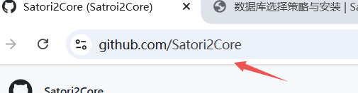
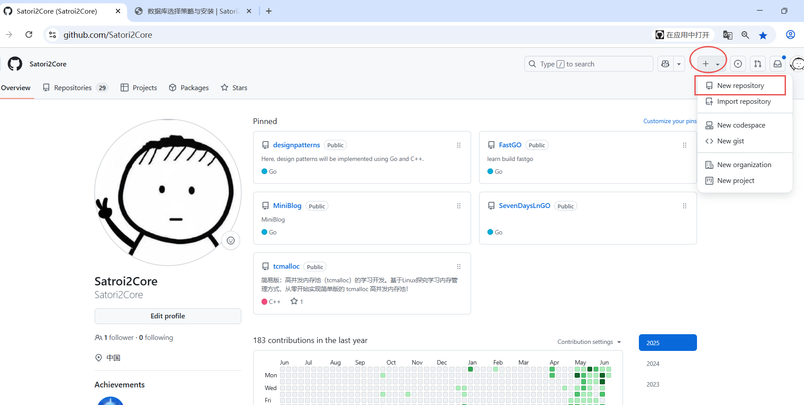
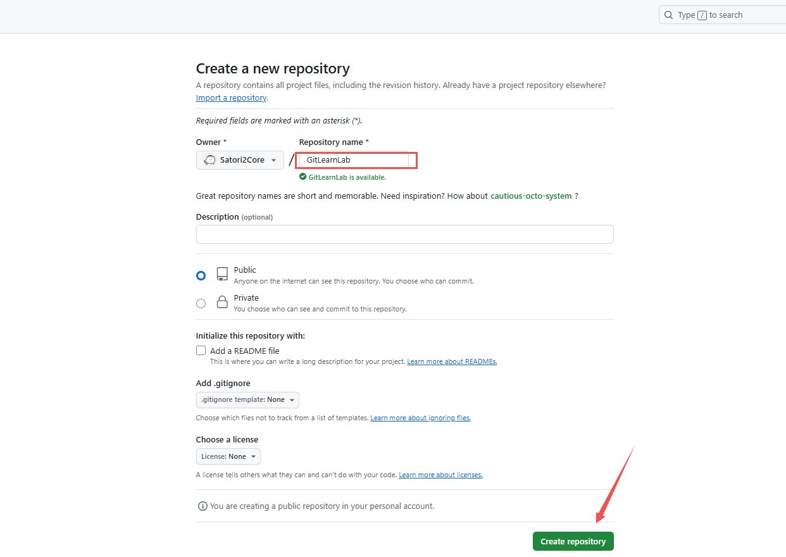

## 0. 前言
代码仓库的初始化，是每个开发者开启项目的“第一步仪式”。它不仅是代码的“起点档案馆”，更是后续协作开发、版本回溯、问题追踪的核心基石。无论是个人练手的小工具，还是团队协作的复杂系统，一个规范的代码仓库都能让开发过程更有序、更高效。

本文将以我的学习实践为例，从0到1演示以完成一个`Go`项目的`Git`仓库初始化全流程——从本地代码的第一次提交，到关联GitHub远程仓库，再到基础的分支管理与协作操作。

本文中将使用一个名为`GitLearnLab`的实战仓库（你也可以跟着一起创建同名仓库同步练习），通过“边操作、边讲解”的方式，把抽象的`Git`概念转化为具体的键盘敲击和命令执行。

> 需要说明的是，文中可能会涉及一些`Git`专业术语（如“暂存区”“分支合并”“Rebase”等），初次接触时不必强求完全理解，后续我会通过系列文章逐一拆解原理。本文的重点是动手实践——毕竟，`Git`的精髓永远藏在“敲下`git commit`的那一刻”。

如果你刚接触`Git`，不妨跟着步骤一步步操作；如果已有基础，也可以跳过熟悉的部分，重点关注“实战中的小技巧”（比如如何优雅解决合并冲突、如何用`stash`临时保存未完成代码）。

最后，代码仓库的初始化没有“标准答案”，但本文会分享我的个人经验总结（标注为“注：”的部分），希望能为你提供一个可参考的起点。现在，让我们打开终端，创建第一个Git仓库，正式开启这段“代码版本之旅”吧！

> 文末有本文提及的`Git`操作及其意义表格供快速参考。

> [前往系列文章合集](/notes/noteroot/MiniBlog/关于项目)
---

## 1. GitHub 仓库搭建

接下来，不必多说，咱直接从0开始搭建一个`Git`仓库用于练习操作。
> 在此默认你有一个GitHub账号。

**【第一步：浏览器中直接输入：github.com/你的用户名 => 来到个人主页】**



---
**【第二步：选择创建分支】**



---

**【第三步：输入仓库名，直接创建代码仓库】**



---

## 2. 初始化本地仓库与.gitignore配置

### 2.1 创建项目目录并初始化Git仓库

本文将以开发一个`Go`项目为了示例，进行`Git`操作练习。【注：不会涉及代码业务内容，无需担心。】

**【项目目录建立】**

此处我将从了根目录开始，建立一个目录进行`Git`练习。

```bash
# mkdir -> 创建目录
# -p -> 支持多级目录创建
mkdir -p ~/workspace/GitLearnLab

# 进入目录
cd ~/workspace/GitLearnLab

# 示例：start -----------------------------------------------------------------
devuser@vm:~$ mkdir -p ~/workspace/GitLearnLab && cd ~/workspace/GitLearnLab
devuser@vm:~/workspace/GitLearnLab$ 
# 示例：end -------------------------------------------------------------------
```

---

**【初始化Git仓库（生成.git隐藏目录）】**
```bash
# 初始化Git仓库
git init

# 示例：start -----------------------------------------------------------------
devuser@vm:~$ mkdir -p ~/workspace/GitLearnLab && cd ~/workspace/GitLearnLab

dev@vm:~/workspace/GitLearnLab$ ll
total 0

dev@vm:~/workspace/GitLearnLab$ git init
hint: Using 'master' as the name for the initial branch. This default branch name
hint: is subject to change. To configure the initial branch name to use in all
hint: of your new repositories, which will suppress this warning, call:
hint: 
hint: 	git config --global init.defaultBranch <name>
hint: 
hint: Names commonly chosen instead of 'master' are 'main', 'trunk' and
hint: 'development'. The just-created branch can be renamed via this command:
hint: 
hint: 	git branch -m <name>
Initialized empty Git repository in /home/dev/workspace/GitLearnLab/.git/

dev@vm:~/workspace/GitLearnLab$ ll
total 0
dev@vm:~/workspace/GitLearnLab$ ls -a
.  ..  .git                                     # .git 就是刚刚命令生成的
dev@vm:~/workspace/GitLearnLab$ 
# 示例：end -------------------------------------------------------------------
```

---

### 2.2 关于.gitignore文件

**.gitignore是Git的核心配置文件**，用于告诉Git哪些文件/目录不需要被追踪（即不会被提交到仓库）。

在项目开发中，我们不会直接提交所有文件，因为可能导致仓库中混入临时文件、依赖缓存、IDE配置等冗余内容，影响仓库整洁和协作效率。

- 创建.gitignore文件：定义“不追踪的文件” —— 不需要提交的文件。

---

【为什么需要.gitignore？】

- **​避免冗余**​：如`Go`项目的`go.sum`（依赖校验文件）、`vendor`目录（依赖缓存）、`IDE`生成的`.idea`/`.vscode`目录等，这些文件无需共享；
- ​保护隐私​：如本地配置文件（.env）、日志文件（*.log）可能包含敏感信息；
- 提升性能​：减少`Git`需要处理的文件数量，加快克隆、拉取等操作速度。

---

**【使用示例】**

在项目根目录创建.gitignore文件（注意以.开头，隐藏文件）：
```bash
# 新建 .gitignore 文件
touch .gitignore    
```

用文本编辑器（如nano或VS Code）打开并添加以下内容（根据项目语言调整）：
> 以下仅作为参考，可自定义不需要`.Git`追踪的内容。

```bash
# Go项目通用忽略规则
*.log          # 忽略所有日志文件
*.tmp          # 忽略临时文件
go.sum         # Go依赖校验文件（可选：若用Go Modules，通常提交；若用dep等工具，可忽略）
vendor/        # 依赖缓存目录（如go mod vendor生成的目录）
bin/           # 编译后的二进制文件（如go build生成的可执行文件）

# IDE/编辑器忽略规则（根据使用的工具调整）
.idea/         # JetBrains IDE（如GoLand）配置目录
.vscode/       # VS Code配置目录
*.suo          # Visual Studio解决方案文件
*.ntvs*        # Visual Studio调试文件
*.njsproj      # Visual Studio项目文件
*.sln          # Visual Studio解决方案文件

# 系统通用忽略规则
.DS_Store      # macOS系统生成的目录元数据
Thumbs.db      # Windows系统生成的缩略图缓存
```

---

## 3. 第一次提交与远程仓库关联

### 3.1 编写 .gitignore 文件

从此处以制定忽略VsCode配置目录为例，进行操作。

```bash
# 假设当前已经在～/workspace/GitLearnLab目录下
touch .gitignore
```

文件中直接写入如下内容：
```bash
.idea/         # JetBrains IDE（如GoLand）配置目录
.vscode/       # VS Code配置目录
/tmp           # 临时目录
```

---

### 3.2 验证.gitignore是否生效

可以通过以下命令检查哪些文件会被Git忽略（需安装git-extras工具，或手动验证）：

```bash
# 手动验证：查看未被追踪的文件（应不包含被忽略的文件）
git status
```

此时，若`.gitignore`配置正确，`git status`应仅显示项目中的有效文件（如后续添加的代码文件），而被忽略的`vendor/`、`.idea/`等目录**不会被列出**。

```bash
# 操作演示：start -----------------------------------------------------------------
devuser@vm:~/workspace/GitLearnLab$ git status
位于分支 master

尚无提交

未跟踪的文件:
  （使用 "git add <文件>..." 以包含要提交的内容）
        .gitignore

提交为空，但是存在尚未跟踪的文件（使用 "git add" 建立跟踪）
devuser@vm:~/workspace/GitLearnLab$ 
# 示例：end -------------------------------------------------------------------
```

---

### 3.3 编写README.md

通常，项目根目录下的`README.md`会包含和项目相关的信息，此处我们不做过多赘述。

在`README.md`写入如下内容：
```bash
# 使用 echo 直接把指定内容写入指定文件
echo "# GitLearnLab 仓库介绍" > README.md
```

---

### 3.4 提交操作

现在，我们有了项目文件和`.gitignore`，可以执行第一次提交了。遵循“**先配置**`.gitignore`，**再提交代码**”的顺序，能避免将冗余文件误提交到仓库。

**【步骤1：添加有效文件到暂存区】**

前文指定`Git`忽略追踪`.vscode`、`.idea/ `、`/tmp`的内容，同时新增了`README.md`作为有效提交文件。

```bash
# 添加所有未跟踪的有效文件（包括.gitignore）
git add .  # 注意：. 表示当前目录所有未忽略的文件（.gitignore本身会被追踪）

# git 命令
# add 执行的操作
```

**【步骤2：提交到本地仓库】**

```bash
# 使用如下命令添加本次提交的信息说明。
git commit -m "feat: 初始化项目，添加主程序及.gitignore配置"

# git 命令
# commit 执行的操作：提交信息
```

**【步骤3：查看提交记】**

```bash
# 应显示一条提交记录，包含`.gitignore`和`main.go`的修改
git log  

# git 命令
# log 执行的操作：日志
```
---

**【操作演示】**
```bash
# 操作演示：start -----------------------------------------------------------------
devuser@vm:~/workspace/GitLearnLab$ git add .
devuser@vm:~/workspace/GitLearnLab$ git commit -m "feat: 初始化项目，添加主程序及.gitignore配置"
作者身份未知

*** 请告诉我您是谁。    ## 出现这个内容是由于我们安装git后没有进行任何配置，解决操作可看后文

运行

  git config --global user.email "you@example.com"
  git config --global user.name "Your Name"

来设置您账号的缺省身份标识。
如果仅在本仓库设置身份标识，则省略 --global 参数。

fatal: 无法自动探测邮件地址（得到 'devuser@vm.(none)'）
devuser@vm:~/workspace/GitLearnLab$ 
# 示例：end -------------------------------------------------------------------
```

