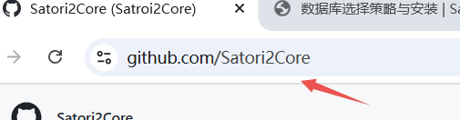
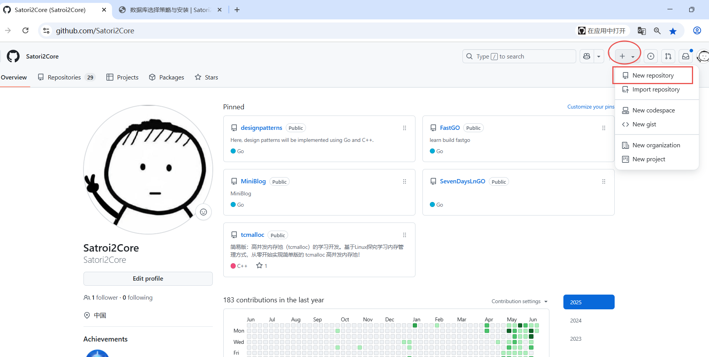
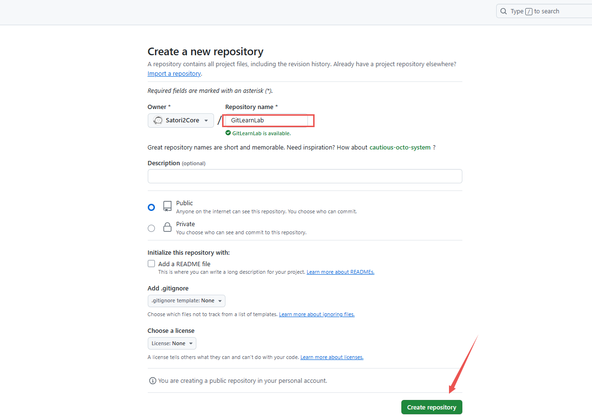
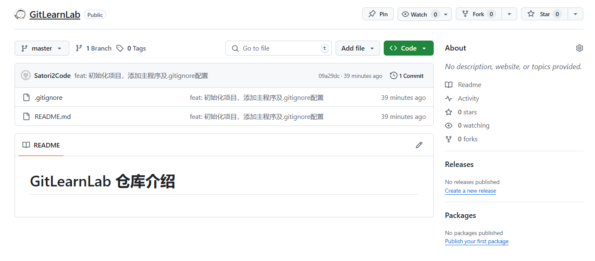

## 0. 前言
代码仓库的初始化，是每个开发者开启项目的“第一步仪式”。它不仅是代码的“起点档案馆”，更是后续协作开发、版本回溯、问题追踪的核心基石。无论是个人练手的小工具，还是团队协作的复杂系统，一个规范的代码仓库都能让开发过程更有序、更高效。

本文将以我的学习实践为例，从0到1演示以完成一个`Go`项目的`Git`仓库初始化全流程——从本地代码的第一次提交，到关联GitHub远程仓库，再到基础的分支管理与协作操作。

本文中将使用一个名为`GitLearnLab`的实战仓库（你也可以跟着一起创建同名仓库同步练习），通过“边操作、边讲解”的方式，把抽象的`Git`概念转化为具体的键盘敲击和命令执行。

> 需要说明的是，文中可能会涉及一些`Git`专业术语（如“暂存区”“分支合并”“Rebase”等），初次接触时不必强求完全理解，后续我会通过系列文章逐一拆解原理。本文的重点是动手实践——毕竟，`Git`的精髓永远藏在“敲下`git commit`的那一刻”。

如果你刚接触`Git`，不妨跟着步骤一步步操作；如果已有基础，也可以跳过熟悉的部分，重点关注“实战中的小技巧”（比如如何优雅解决合并冲突、如何用`stash`临时保存未完成代码）。

最后，代码仓库的初始化没有“标准答案”，但本文会分享我的个人经验总结（标注为“注：”的部分），希望能为你提供一个可参考的起点。现在，让我们打开终端，创建第一个Git仓库，正式开启这段“代码版本之旅”吧！

> 文末有本文提及的`Git`操作及其意义表格供快速参考。

> 我的随笔录：[Satori2Core 随笔录 —— 更新计划 / 笔录目录](https://satori2core.github.io/notes/noteroot/about/%E5%85%B3%E4%BA%8E%E6%9B%B4%E6%96%B0%E8%AE%A1%E5%88%92.html)
---

## 1. GitHub 仓库搭建

接下来，不必多说，咱直接从0开始搭建一个`Git`仓库用于练习操作。
> 在此默认你有一个GitHub账号。

**【第一步：浏览器中直接输入：github.com/你的用户名 => 来到个人主页】**



---
**【第二步：选择创建分支】**



---

**【第三步：输入仓库名，直接创建代码仓库】**



---

## 2. 初始化本地仓库与.gitignore配置

### 2.1 创建项目目录并初始化Git仓库

本文将以开发一个`Go`项目为了示例，进行`Git`操作练习。【注：不会涉及代码业务内容，无需担心。】

**【项目目录建立】**

此处我将从了根目录开始，建立一个目录进行`Git`练习。

```bash
# mkdir -> 创建目录
# -p -> 支持多级目录创建
mkdir -p ~/workspace/GitLearnLab

# 进入目录
cd ~/workspace/GitLearnLab

# 示例：start -----------------------------------------------------------------
devuser@vm:~$ mkdir -p ~/workspace/GitLearnLab && cd ~/workspace/GitLearnLab
devuser@vm:~/workspace/GitLearnLab$ 
# 示例：end -------------------------------------------------------------------
```

---

**【初始化Git仓库（生成.git隐藏目录）】**
```bash
# 初始化Git仓库
git init

# 示例：start -----------------------------------------------------------------
devuser@vm:~$ mkdir -p ~/workspace/GitLearnLab && cd ~/workspace/GitLearnLab

dev@vm:~/workspace/GitLearnLab$ ll
total 0

dev@vm:~/workspace/GitLearnLab$ git init
hint: Using 'master' as the name for the initial branch. This default branch name
hint: is subject to change. To configure the initial branch name to use in all
hint: of your new repositories, which will suppress this warning, call:
hint: 
hint: 	git config --global init.defaultBranch <name>
hint: 
hint: Names commonly chosen instead of 'master' are 'main', 'trunk' and
hint: 'development'. The just-created branch can be renamed via this command:
hint: 
hint: 	git branch -m <name>
Initialized empty Git repository in /home/dev/workspace/GitLearnLab/.git/

dev@vm:~/workspace/GitLearnLab$ ll
total 0
dev@vm:~/workspace/GitLearnLab$ ls -a
.  ..  .git                                     # .git 就是刚刚命令生成的
dev@vm:~/workspace/GitLearnLab$ 
# 示例：end -------------------------------------------------------------------
```

---

### 2.2 关于.gitignore文件

**.gitignore是Git的核心配置文件**，用于告诉Git哪些文件/目录不需要被追踪（即不会被提交到仓库）。

在项目开发中，我们不会直接提交所有文件，因为可能导致仓库中混入临时文件、依赖缓存、IDE配置等冗余内容，影响仓库整洁和协作效率。

- 创建.gitignore文件：定义“不追踪的文件” —— 不需要提交的文件。

---

**【为什么需要.gitignore？】**

- **​避免冗余**​：如`Go`项目的`go.sum`（依赖校验文件）、`vendor`目录（依赖缓存）、`IDE`生成的`.idea`/`.vscode`目录等，这些文件无需共享；
- ​保护隐私​：如本地配置文件（.env）、日志文件（*.log）可能包含敏感信息；
- 提升性能​：减少`Git`需要处理的文件数量，加快克隆、拉取等操作速度。

---

**【使用示例】**

在项目根目录创建.gitignore文件（注意以.开头，隐藏文件）：
```bash
# 新建 .gitignore 文件
touch .gitignore    
```

用文本编辑器（如nano或VS Code）打开并添加以下内容（根据项目语言调整）：
> 以下仅作为参考，可自定义不需要`.Git`追踪的内容。

```bash
# Go项目通用忽略规则
*.log          # 忽略所有日志文件
*.tmp          # 忽略临时文件
go.sum         # Go依赖校验文件（可选：若用Go Modules，通常提交；若用dep等工具，可忽略）
vendor/        # 依赖缓存目录（如go mod vendor生成的目录）
bin/           # 编译后的二进制文件（如go build生成的可执行文件）

# IDE/编辑器忽略规则（根据使用的工具调整）
.idea/         # JetBrains IDE（如GoLand）配置目录
.vscode/       # VS Code配置目录
*.suo          # Visual Studio解决方案文件
*.ntvs*        # Visual Studio调试文件
*.njsproj      # Visual Studio项目文件
*.sln          # Visual Studio解决方案文件

# 系统通用忽略规则
.DS_Store      # macOS系统生成的目录元数据
Thumbs.db      # Windows系统生成的缩略图缓存
```

---

## 3. 第一次代码提交

### 3.1 编写 .gitignore 文件

从此处以制定忽略VsCode配置目录为例，进行操作。

```bash
# 假设当前已经在～/workspace/GitLearnLab目录下
touch .gitignore
```

文件中直接写入如下内容：
```bash
.idea/         # JetBrains IDE（如GoLand）配置目录
.vscode/       # VS Code配置目录
/tmp           # 临时目录
```

---

### 3.2 验证.gitignore是否生效

可以通过以下命令检查哪些文件会被Git忽略（需安装git-extras工具，或手动验证）：

```bash
# 手动验证：查看未被追踪的文件（应不包含被忽略的文件）
git status
```

此时，若`.gitignore`配置正确，`git status`应仅显示项目中的有效文件（如后续添加的代码文件），而被忽略的`vendor/`、`.idea/`等目录**不会被列出**。

```bash
# 操作演示：start -----------------------------------------------------------------
devuser@vm:~/workspace/GitLearnLab$ git status
位于分支 master

尚无提交

未跟踪的文件:
  （使用 "git add <文件>..." 以包含要提交的内容）
        .gitignore

提交为空，但是存在尚未跟踪的文件（使用 "git add" 建立跟踪）
devuser@vm:~/workspace/GitLearnLab$ 
# 示例：end -------------------------------------------------------------------
```

---

### 3.3 编写README.md

通常，项目根目录下的`README.md`会包含和项目相关的信息，此处我们不做过多赘述。

在`README.md`写入如下内容：
```bash
# 使用 echo 直接把指定内容写入指定文件
echo "# GitLearnLab 仓库介绍" > README.md
```

---

### 3.4 提交操作

现在，我们有了项目文件和`.gitignore`，可以执行第一次提交了。遵循“**先配置**`.gitignore`，**再提交代码**”的顺序，能避免将冗余文件误提交到仓库。

**【步骤1：添加有效文件到暂存区】**

前文指定`Git`忽略追踪`.vscode`、`.idea/ `、`/tmp`的内容，同时新增了`README.md`作为有效提交文件。

```bash
# 添加所有未跟踪的有效文件（包括.gitignore）
git add .  # 注意：. 表示当前目录所有未忽略的文件（.gitignore本身会被追踪）

# git 命令
# add 执行的操作
```

**【步骤2：提交到本地仓库】**

```bash
# 使用如下命令添加本次提交的信息说明。
git commit -m "feat: 初始化项目，添加主程序及.gitignore配置"

# git 命令
# commit 执行的操作：提交信息
```

**【步骤3：查看提交记】**

```bash
# 应显示一条提交记录，包含`.gitignore`和`main.go`的修改
git log  

# git 命令
# log 执行的操作：日志
```
---

**【操作演示】**
```bash
# 操作演示：start -----------------------------------------------------------------
devuser@vm:~/workspace/GitLearnLab$ git add .
devuser@vm:~/workspace/GitLearnLab$ git commit -m "feat: 初始化项目，添加主程序及.gitignore配置"
作者身份未知

*** 请告诉我您是谁。    ## 出现这个内容是由于我们安装git后没有进行任何配置，解决操作可看后文

运行

  git config --global user.email "you@example.com"
  git config --global user.name "Your Name"

来设置您账号的缺省身份标识。
如果仅在本仓库设置身份标识，则省略 --global 参数。

fatal: 无法自动探测邮件地址（得到 'devuser@vm.(none)'）
devuser@vm:~/workspace/GitLearnLab$ 
# 示例：end -------------------------------------------------------------------
```

---


## 4. Git 本地基本配置 (首次使用 Git 必做)

> [【项目开发】Git基本操作 —— 本地基本配置指南](/notes/noteroot/project/项目开发之Git本地基本配置)

---

## 5. 关联GitHub远程仓库并推送

### 5.1 仓库建立

> 如文章开头

---

### 5.2 关联远程仓库：HTTP/HTTPS 与 SSH 差异

远程仓库关联主要有两种主流方式：​`HTTP/HTTPS` 协议和 `​SSH` 协议。两者在底层通信机制、认证方式、适用场景上有明显差异，选择时需结合具体需求（如安全性、操作频率、环境限制等）。

---
**【`​HTTP、HTTPS`协议】**

- ​通信加密：HTTPS 是加密的（TLS/SSL），HTTP 不加密（已逐渐被淘汰）
- ​认证方式​：账号密码（或个人访问令牌 PAT）
- ​适用场景​：临时访问、轻量级操作、无密钥管理需求
- ​跨平台兼容性​：无需额外配置（浏览器/系统自带 HTTP 客户端）

---

**【`SSH`协议】**

- ​通信加密：全程加密（基于 RSA/ECDSA 等算法）
- ​认证方式​：密钥对（公钥存远程，私钥存本地）
- ​适用场景​：频繁操作、自动化脚本、需要免密登录
- ​跨平台兼容性​：需生成并配置 SSH 密钥（跨平台需注意密钥格式）

---


### 5.3 HTTP/HTTPS 方式：账号密码认证

**原理**​：通过浏览器常用的 HTTP/HTTPS 协议与远程仓库（如 GitHub、GitLab）通信。首次关联或推送时，需输入账号密码（或个人访问令牌 PAT，GitHub 已禁用纯密码认证）完成身份验证。

**配置操作**

```bash
# 1. 在 GitHub 仓库页面 → 点击 Code 按钮 → 选择 HTTPS 协议 → 复制仓库 URL（如 https://github.com/你的用户名/GitLearnLab.git）。

# 2. 本地关联远程仓库
git remote add origin https://github.com/你的用户名/GitLearnLab.git

# 3. 推送代码（首次需认证）​
git push -u origin master
```

此时会弹出对话框要求输入 GitHub 账号和密码（或 PAT）：

- ​账号​：你的 GitHub 用户名；
- ​密码​：若为 GitHub，需使用 个人访问令牌（PAT）（需勾选 repo 权限）。


---

### 5.4 SSH 方式：密钥对认证

**原理**​:通过 SSH（Secure Shell）协议建立加密通道，使用非对称加密​（公钥 + 私钥）完成身份验证：

- 公钥​：上传到远程仓库（如 GitHub 的 Settings → SSH and GPG keys）；
- 私钥​：保存在本地电脑（需严格保密，泄露会导致仓库被非法访问）。

当本地需要连接远程仓库时，SSH 客户端会用私钥生成签名，远程仓库用公钥验证签名合法性，从而完成免密认证。

**配置操作**

- 步骤1：生成 SSH 密钥对【在本地终端执行（一路回车使用默认值）：】
```bash
ssh-keygen -t ed25519 -C "你的邮箱@example.com"  # 推荐 ED25519 算法（更安全）
# 若系统不支持 ED25519，可用 RSA：ssh-keygen -t rsa -b 4096 -C "你的邮箱@example.com"

# 生成的密钥对默认存储在：
# 公钥：~/.ssh/id_ed25519.pub（或 ~/.ssh/id_rsa.pub）；
# 私钥：~/.ssh/id_ed25519（或 ~/.ssh/id_rsa）。
```

- 步骤2：将公钥添加到远程仓库
> 参考：[【项目开发】Git基本操作 —— 本地基本配置指南](/notes/noteroot/project/项目开发之Git本地基本配置)

- 步骤3：本地关联远程仓库（SSH 协议）​

```bash
git remote add origin git@github.com:你的用户名/GitLearnLab.git  # 注意 URL 格式是 git@...
```

- 步骤4：推送代码（首次需验证密钥）​

```bash
git push -u origin master
```
> 首次推送时，SSH 会提示确认远程仓库的指纹（如 The authenticity of host 'github.com (140.82.114.4)' can't be established...），输入 yes 确认后，后续操作将自动使用私钥认证，无需重复输入密码。


### 5.5 如何选择？​

根据需求选择即可：

- ​选 HTTP/HTTPS​：临时操作、无 SSH 密钥管理权限（如公共电脑）、或远程仓库不支持 SSH（极少见）。
- ​选 SSH​：长期维护项目、需要免密推送、或注重安全性（推荐开发者日常使用）。

### 5.6 验证远程仓库关联方式

```bash
git remote -v

# 若 URL 以 https://github.com/... 开头 → HTTP/HTTPS 协议
# 若 URL 以 git@github.com:... 开头 → SSH 协议
```

---

## 6. 第一次Git提交推送操作总揽

**操作说明**

- 环境准备​：创建并进入项目目录，初始化Git仓库
- ​`.gitignore`配置​：创建忽略规则文件，避免提交冗余文件
- ​用户配置​：设置全局用户名和邮箱（首次使用必须）
- ​项目文件​：创建README.md作为项目说明文档
- ​首次提交​：将文件添加到暂存区并提交到本地仓库
- ​远程关联​：选择HTTP或SSH方式关联GitHub仓库
- ​代码推送​：将本地提交推送到远程仓库
- ​结果验证​：检查远程关联状态和提交历史

```bash
# --------------------------
# 环境准备
# --------------------------
# 创建项目目录并进入
mkdir -p ~/workspace/GitLearnLab && cd ~/workspace/GitLearnLab

# 初始化Git仓库
git init

# --------------------------
# 配置 .gitignore
# --------------------------
cat > .gitignore << EOF
# 这里内容省略一下
EOF

# --------------------------
# 配置用户身份（首次使用必须）
# --------------------------
git config --global user.name "你的GitHub用户名"
git config --global user.email "你的GitHub注册邮箱"

# --------------------------
# 创建项目文件
# --------------------------
echo "# GitLearnLab 仓库介绍" > README.md

# --------------------------
# 第一次提交
# --------------------------
git add .
git commit -m "feat: 初始化项目，添加主程序及.gitignore配置"
# --------------------------
# 示例
# --------------------------
devuser@vm:~/workspace/GitLearnLab$ git commit -m "feat: 初始化项目，添加主程序及.gitignore配置"
[master （根提交） 09a29dc] feat: 初始化项目，添加主程序及.gitignore配置
 2 files changed, 4 insertions(+)
 create mode 100644 .gitignore
 create mode 100644 README.md
# --------------------------

# --------------------------
# 关联远程仓库（二选一）
# --------------------------

# 方式一：HTTP/HTTPS方式（需输入账号密码或PAT）
# git remote add origin https://github.com/你的用户名/GitLearnLab.git

# 方式二：SSH方式（推荐，需提前配置SSH密钥）
git remote add origin git@github.com:你的用户名/GitLearnLab.git

# --------------------------
# 示例
# --------------------------
devuser@vm:~/workspace/GitLearnLab$ git commit -m "feat: 初始化项目，添加主程序及.gitignore配置"
[master （根提交） 09a29dc] feat: 初始化项目，添加主程序及.gitignore配置
 2 files changed, 4 insertions(+)
 create mode 100644 .gitignore
 create mode 100644 README.md
# --------------------------

# --------------------------
# 推送代码到GitHub
# --------------------------
git push -u origin master

# --------------------------
# 验证操作结果
# --------------------------
# 查看远程仓库关联状态
git remote -v

# --------------------------
# 示例
# --------------------------
devuser@vm:~/workspace/GitLearnLab$ git remote -v
origin	git@github.com:Satori2Core/GitLearnLab.git (fetch)
origin	git@github.com:Satori2Core/GitLearnLab.git (push)
# --------------------------

# 查看提交历史
git log --oneline --graph --decorate

# --------------------------
# 示例
# --------------------------
devuser@vm:~/workspace/GitLearnLab$ git log --oneline --graph --decorate
* 09a29dc (HEAD -> master, origin/master) feat: 初始化项目，添加主程序及.gitignore配置
# --------------------------
```

**【成果展示】**


---

## 7. 总结：本文中基本Git操作指令及其意义

| **Git 指令**                  | **功能描述**                                                                 | **常见参数/选项**                                                                 | **示例**                                                                 |
|-------------------------------|-----------------------------------------------------------------------------|---------------------------------------------------------------------------------|-------------------------------------------------------------------------|
| `git init`                    | 初始化本地 Git 仓库（生成 `.git` 隐藏目录）                                   | 无                                                                              | `git init`                                                              |
| `git config --global user.name` | 设置全局用户名（用于提交记录的身份标识）                                      | `--global`：全局配置（作用于当前用户所有仓库）；省略则仅当前仓库生效              | `git config --global user.name "张三"`                                  |
| `git config --global user.email` | 设置全局邮箱（与用户名绑定，用于提交记录的身份验证）                          | `--global`：全局配置                                                              | `git config --global user.email "zhangsan@example.com"`                 |
| `touch .gitignore`            | 创建 `.gitignore` 忽略规则文件（用于指定不追踪的文件/目录）                    | 无                                                                              | `touch .gitignore`                                                      |
| `git add <文件/目录>`         | 将文件/目录添加到暂存区（准备提交到本地仓库）                                 | `.`：添加当前目录所有未忽略的文件；`-A`：添加所有文件（包括删除操作）            | `git add .`（添加所有有效文件）                                         |
| `git commit -m "提交信息"`     | 将暂存区内容提交到本地仓库（生成版本记录）                                    | `-m`：指定提交信息（必填）；`-a`：自动添加已追踪文件的修改（无需手动 `add`）     | `git commit -m "feat: 初始化项目配置"`                                   |
| `git status`                  | 查看当前仓库状态（未跟踪文件、已修改文件、暂存区状态等）                       | 无                                                                              | `git status`（显示当前未提交的变化）                                    |
| `git log`                     | 查看本地仓库的提交历史（包含提交哈希、作者、时间、提交信息）                   | `--oneline`：简化显示（单行/条）；`-n 5`：限制显示最近 5 条记录                 | `git log --oneline`（简洁查看提交记录）                                  |
| `git remote add origin <URL>`  | 关联远程仓库（将本地仓库与 GitHub/GitLab 等远程仓库绑定）                      | `origin`：远程仓库别名（默认名称，可自定义）；`<URL>`：远程仓库地址（HTTP/SSH） | `git remote add origin https://github.com/用户名/GitLearnLab.git`       |
| `git push -u origin 分支名`    | 将本地提交推送到远程仓库（`-u` 表示设置上游分支，后续可直接 `git push`）       | `origin`：远程仓库别名；`master`/`main`：分支名（默认主分支）                    | `git push -u origin master`（首次推送主分支到远程）                      |
| `git remote -v`               | 查看当前关联的远程仓库信息（包括 URL 和别名）                                 | 无                                                                              | `git remote -v`（显示远程仓库地址及别名）                                |

